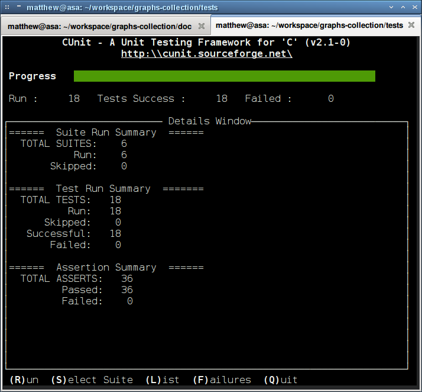

% graphs-collection
% Matthew Henderson
% \tiny{Created Wed Mar 19 13:18:37 GMT 2014. Last updated Wed Mar 19 17:14:59 GMT 2014.}

# Introduction

## History

- Atlas of Graphs
- ...

## Background

- igraph
- NetworkX
- ...

# Tutorial

## Adding new data

When adding new graph data new tests must be created and registered with the
test system.

- Adding tests
- Running tests

## Adding tests

There are two steps to adding new tests.

- Creating a test suite
- Registering a test suite with the test system

## Creating a test suite

A test suite consists of a setup or init function and a teardown or clean
function.

For example a setup function for the Chvatal graph looks like:

    int init_suite_chvatal(void)
    {
     json_error_t error;
     if (NULL == (i_file = fopen("../src/Classic/Chvatal/chvatal.gml", "r")) ||
       (NULL == (json = json_load_file("../src/Classic/Chvatal/chvatal_properties.json", 0, &error)))) {
      return -1;
     }

     else {
      igraph_read_graph_gml(&g, i_file);
      get_parameter_data();
      compute_all_parameters();
      return 0;
     }
    }

## Creating a test suite continued

An example of a teardown function for the Chvatal graph looks like:

    int clean_suite_chvatal(void)
    {
     if (0 != fclose(i_file)) {
      return -1;
     }
     else {
      igraph_destroy(&g);
      i_file = NULL;
      return 0;
     }
    }

Now we can create the test suite itself and add it to the registry

    CU_pSuite pSuite_chvatal = NULL;
    pSuite_chvatal = CU_add_suite("Chvatal Graph", init_suite_chvatal, clean_suite_chvatal);

## Adding tests

The final step is to add some tests to the test suite

    if ((NULL == CU_add_test(pSuite_chvatal, "Test basic parameters.", test_basic_parameters)) ||
      (NULL == CU_add_test(pSuite_chvatal, "Test degree parameters.", test_degree_parameters)) ||
      (NULL == CU_add_test(pSuite_chvatal, "Test distance parameters.", test_distance_parameters)))
    {
     CU_cleanup_registry();
     return CU_get_error();
    }

## Running tests

To run the tests, call Make to compile the test program and then run. The
output should look something like:

if all tests are successful.

